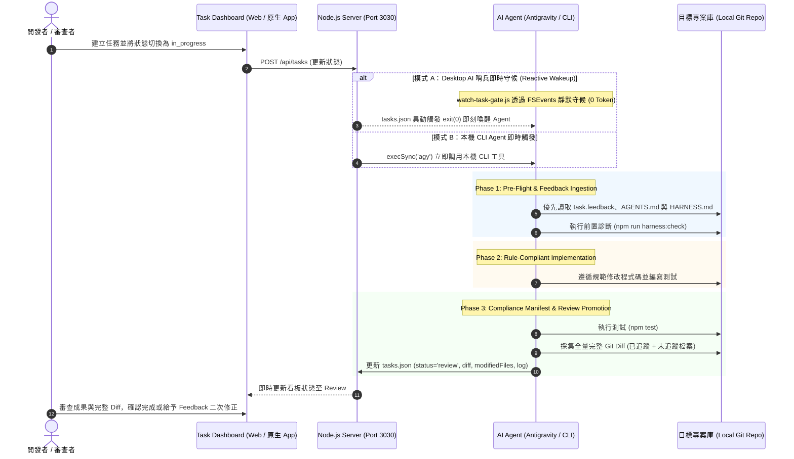

# 📋 Task Dashboard (macOS App & Web Hub)

> **Task Dashboard** 是專為本機軟體工程與 AI 協作打造的輕量任務調度中心。結合 **Cocoa/WebKit 原生 macOS 桌面應用**、**內嵌 Node.js Web 服務**、**macOS 原生 Finder 專案選取** 與 **Antigravity / 本機 CLI Agent 雙軌自動執行引擎**，將隨性的 AI 對話轉化為標準化、可追蹤、高可靠的票務（Ticket-driven）工程流。

---

## 📑 目錄 (Table of Contents)

- [🌟 核心特色](#-核心特色)
- [🏗️ 系統架構與運作機制](#️-系統架構與運作機制)
  - [1. 系統架構與時序流程](#1-系統架構與時序流程)
  - [2. 單一真實資料庫 (SSOT) 儲存機制](#2-單一真實資料庫-ssot-儲存機制)
  - [3. 雙軌 AI 自動開工機制 (Dual Automation Engines)](#3-雙軌-ai-自動開工機制-dual-automation-engines)
  - [4. 嚴格 3-Phase Execution Gate (執行 SOP)](#4-嚴格-3-phase-execution-gate-執行-sop)
  - [5. 狀態機生命週期與 Diff 判定準則](#5-狀態機生命週期與-diff-判定準則)
- [🚀 快速開始與使用方法](#-快速開始與使用方法)
  - [環境需求](#環境需求)
  - [模式一：原生 macOS App (最推薦)](#模式一原生-macos-app-最推薦)
  - [模式二：本機 Web 服務模式](#模式二本機-web-服務模式)
  - [模式三：背景常駐服務管理](#模式三背景常駐服務管理)
- [💻 日常操作流程指南](#-日常操作流程指南)
  - [1. 專案選擇與路徑綁定](#1-專案選擇與路徑綁定)
  - [2. 建立任務 (Task Creation)](#2-建立任務-task-creation)
  - [3. 任務開工與 AI 自動調度](#3-任務開工與-ai-自動調度)
  - [4. 成果審查與 Feedback 迭代 (Review & Feedback)](#4-成果審查與-feedback-迭代-review--feedback)
  - [5. 系統偏好設定 (Settings)](#5-系統偏好設定-settings)
- [📜 指令速查表 (Scripts Reference)](#-指令速查表-scripts-reference)
- [📁 專案目錄結構](#-專案目錄結構)
- [🛠️ 常見問題與疑難排解 (FAQ)](#️-常見問題與疑難排解-faq)
- [📄 授權條款 (License)](#-授權條款-license)

---

## 🌟 核心特色

1. **極速原生 macOS 視窗體驗**：
   - 使用 `clang` 編譯的輕量級 Cocoa + WebKit 原生外殼 (`TaskDashboard.app`)，毫秒級建置、免龐大 Xcode 專案相依。
   - 內建生命週期管理：啟動時自動偵測 Node.js 環境並啟動後端，關閉視窗時優雅終止背景服務。
   - 採用無快取本地掛載，修改前端或後端程式碼即時熱生效。
2. **macOS 原生資料夾選取**：
   - 整合 macOS 原生 `NSOpenPanel`，點擊按鈕即可呼叫系統 Finder 挑選專案，自動綁定 Git 目錄與設定預設專案。
3. **單一真實來源 (Single Source of Truth, SSOT)**：
   - 執行期任務與設定持久化於 macOS 系統應用支援目錄 (`~/Library/Application Support/TaskDashboard/`)。
   - 專案倉庫內的 `data/` 僅作為全新檢出時的初始化範本，執行時永不污染代碼庫的版本控制。
4. **雙軌 AI 自動開工機制 (Dual Automation Engines)**：
   - **模式 A（Desktop AI 哨兵即時喚醒）**：原生 FSEvents 靜默待命（0 Token 開銷），一旦任務進入 `in_progress` 即時喚醒 Antigravity / Claude / Cursor 開工。
   - **模式 B（本機 CLI Agent 即時觸發）**：在 Web 介面開啟 CLI Agent 模式，拖曳任務即刻自動調用本地 `agy` / `claude` 命令行工具並記錄日誌。
5. **嚴格 3-Phase Execution Gate**：
   - 前置檢核、規範合規實作、完整 Git Diff 採集與自動推至審查（Review）門禁，杜絕未經測試與截斷的代碼提交。

---

## 🏗️ 系統架構與運作機制

### 1. 系統架構與時序流程

Task Dashboard 由三大核心層級組成：
- **Presentation Layer**：Cocoa 原生外殼 (`src/native/main.m`) 與響應式 Web 面板 (`src/public/index.html`)。
- **Service & API Layer**：Node.js 原生 HTTP 伺服器 (`src/server/server.js`)，提供任務管理、專案探測、CLI 調度與配置 API。
- **Execution & Storage Layer**：`~/Library/Application Support/TaskDashboard/` 資料庫、目標 Git 專案庫與 AI Agent（Antigravity / CLI）。



---

### 2. 單一真實資料庫 (SSOT) 儲存機制

為了避免開發者在不同專案切換時污染 Git 追蹤狀態，Task Dashboard 嚴格落實資料庫解耦：

- **系統資料庫目錄**：`~/Library/Application Support/TaskDashboard/`
  - `tasks.json`：存放所有任務記錄、完整 Git Diff、修改清單與執行日誌。
  - `projects.json`：存放已加入的專案路徑、名稱與偏好設定。
  - `settings.json`：存放系統設定（CLI Agent 開關、自訂指令、自訂資料庫路徑、字體設定等）。
  - `watch-task-gate.js`：伺服器啟動時自動同步並配置執行權限的原生哨兵腳本。
- **專案範本目錄**：`data/`（倉庫內）
  - 僅在全新安裝或系統資料庫不存在時作為複製藍本。
  - 執行期任何讀寫操作**絕不修改**專案資料夾內的 `data/`。

---

### 3. 雙軌 AI 自動開工機制 (Dual Automation Engines)

Task Dashboard 支援兩種自動執行通道，依開發場景自由切換：

| 特性比較 | 模式 A：Desktop AI 哨兵待命 (推薦) | 模式 B：本機 CLI Agent 即時模式 |
|---|---|---|
| **適用場景** | Antigravity IDE、Claude Desktop、Cursor 等桌面 AI 環境 | 本地終端機、獨立指令工具 (`agy`、`claude` 等) |
| **觸發方式** | 背景守候腳本 `watch-task-gate.js` 偵測到 `in_progress` 瞬間 `exit(0)` 喚醒 | Web Server 接收狀態變更後，以 `child_process` 異步直接呼叫 CLI |
| **資源消耗** | 守候時 **0 Token、0 CPU 負載** (原生 FSEvents 事件驅動) | 任務觸發時啟動 CLI 子行程，無任務時 0 消耗 |
| **備用機制** | 若環境無終端存取權限，可使用 2 分鐘一次排程 (`schedule`) 輪詢 | 支援失敗超時控制與終端日誌自動回填 `executionLog` |

---

### 4. 嚴格 3-Phase Execution Gate (執行 SOP)

所有 AI Agent 開工與交付時均須遵循 `AGENTS.md` 規範的三階段門禁：

1. **Phase 1: Pre-Flight & Review Feedback Ingestion (前置審查與規範檢閱)**
   - **Feedback 門禁（最高優先）**：檢查任務中是否存在 `task.feedback`。若存在，代表使用者前次審查提出的修正要求，必須將其作為本次實作的第一目標。
   - 切換至目標專案目錄，閱讀規範文件 (`AGENTS.md`、`HARNESS.md`、`README.md`)。
   - 執行該專案的診斷指令（如 `npm run harness:check`）。
2. **Phase 2: Rule-Compliant Implementation (合規實作)**
   - 嚴格限定在目標專案目錄中實作，禁止產生無關的跨專案副作用。
   - 編寫程式碼並完成相關測試套件。
3. **Phase 3: Compliance Manifest & Review Promotion (合規驗證與推進)**
   - 執行專案測試（如 `npm test`）。
   - **採集全量無截斷 Git Diff**：同時採集已追蹤檔案 (`git diff HEAD`) 與未追蹤檔案 (`git diff --no-index /dev/null <file>`)。嚴禁使用省略符號 (`...`)。
   - 回填 `modifiedFiles`、完整 `diff` 與 `executionLog`。
   - 若包含 Feedback，將內容歸檔附加至 `task.description` 尾端後清空 `task.feedback`。
   - 將任務狀態變更為 `status: "review"`，通知使用者驗收。

---

### 5. 狀態機生命週期與 Diff 判定準則

```text
[ todo ] ──────(使用者指派或開工)──────> [ in_progress ]
   ▲                                         │
   │                                    (3-Phase Gate 完工)
(退回重新規劃)                                 ▼
   │                                    [ review ]
   │                                    │        │
   └───(審查不通過 / 填寫 Feedback)───────┘        └──(驗收通過)──> [ done ]
```

- **Diff 是產物而非觸發條件**：工作區有未提交的 Git Diff 不會被視為完工，必須由 Agent 完成測試並顯式發出交付信號，方能推入 `review`。
- **產物狀態隔離**：任務重新切換回 `in_progress` 時，後端自動重置前次殘留的 `diff` 與 `modifiedFiles`，避免歷史記錄誤導審查。

---

## 🚀 快速開始與使用方法

### 環境需求

- **作業系統**：macOS 11.0 (Big Sur) 或更高版本（支援 Apple Silicon 與 Intel x86_64 架構）。
- **Node.js**：Node.js 18.0.0 以上（推薦 v20+ 或 v24+）。
- **編譯器**：Clang（安裝 Xcode Command Line Tools：`xcode-select --install`）。

---

### 模式一：原生 macOS App (最推薦)

原生 App 擁有獨立 macOS 視窗、Dock 圖示、自動管理後端 Server，是最流暢的使用方式。

#### 1. 一鍵編譯並安裝至桌面

```bash
cd ~/projects/task-dashboard
npm run install:desktop
```

執行後會在 `~/Desktop/` 建立 `TaskDashboard.app`，並自動編譯 Objective-C 原生外殼。

#### 2. 開啟與使用

- 直接雙擊桌面上的 **`TaskDashboard.app`**。
- App 啟動時會自動在背景啟動 Node.js Web Server（Port 3030）並透過 WKWebView 載入看板。
- 關閉 App 視窗或按 `Cmd + Q` 時，原生外殼會自動清理後端行程與連接埠，不殘留孤兒處理程序。

---

### 模式二：本機 Web 服務模式

如果你偏好直接使用瀏覽器（Chrome、Safari、Arc 等）管理任務：

```bash
cd ~/projects/task-dashboard

# 啟動開發伺服器
npm run dev

# 或一般啟動
npm start
```

開啟瀏覽器前往：**`http://localhost:3030`**

---

### 模式三：背景常駐服務管理

專案提供快速啟動與停止的 Shell 腳本：

```bash
# 在背景靜默啟動伺服器並自動開啟瀏覽器
bash scripts/start.sh

# 停止正在執行的伺服器與釋放 Port 3030
bash scripts/stop.sh
```

---

## 💻 日常操作流程指南

### 1. 專案選擇與路徑綁定

- 點擊頂部導航列的 **「選擇資料夾」** 按鈕。
- 系統將呼叫 macOS 原生 Finder 對話框，挑選任何本地 Git 專案目錄（例如 `~/projects/my-web-app`）。
- 選擇後，該專案會自動加入專案列表並設為當前作用專案。

### 2. 建立任務 (Task Creation)

- 點擊看板上的 **「+ 新增任務」** 按鈕。
- 填寫以下欄位：
  - **標題**：具體行動目標（例如：`新增使用者登入驗證 API`）。
  - **關聯專案**：選擇任務歸屬的專案。
  - **優先等級**：高 (High)、中 (Medium)、低 (Low)。
  - **標籤**：功能分類標籤（如 `backend`、`auth`、`bug`）。
  - **詳細說明**：明確的驗收標準與需求描述。

### 3. 任務開工與 AI 自動調度

將任務卡片拖曳至 **「進行中 (In Progress)」** 欄位：

- **若使用 Antigravity / Desktop AI 模式**：
  在 AI 終端或對話中運行一次哨兵指令：
  ```bash
  npm run watch:gate
  ```
  哨兵將在背景靜默監聽（0 Token 消耗）。一旦你將任務拖入 `in_progress`，哨兵立即退出並喚醒 AI，AI 依照 3-Phase SOP 開工！
- **若使用 CLI Agent 模式**：
  在系統設定中開啟「啟用 CLI Agent」，後端將在任務進入 `in_progress` 的瞬間自動於專案目錄執行指定指令（如 `agy`）。

### 4. 成果審查與 Feedback 迭代 (Review & Feedback)

當 AI 完工後，任務卡片會自動出現在 **「審查中 (Review)」**：

- 點擊任務卡片展開詳細資訊，即可查閱：
  - **修改檔案清單 (Modified Files)**。
  - **全量 Git Diff (語法高亮)**。
  - **AI 執行紀錄 (Execution Log)**：包含測試通過證明與規範檢查。
- **驗收通過**：點擊「完成 (Done)」，任務正式封存。
- **需要修改 (Feedback)**：
  在「審查反饋 (Feedback)」文字框輸入具體修改意見（例如：`密碼長度驗證請改為至少 8 碼，並補上邊界測試`），點擊送出。
  - 任務將重新退回 `in_progress`。
  - AI 再次喚醒時，會以你的反饋為最高優先級目標進行修正！

### 5. 系統偏好設定 (Settings)

點擊右上角 **⚙️ 設定圖示**：
- **CLI Agent 自動觸發**：開啟/關閉自動調用 CLI 工具。
- **CLI 指令**：自訂開工命令（預設為 `agy`，亦可設定為 `claude` 或其他腳本）。
- **資料庫路徑**：預設為 `~/Library/Application Support/TaskDashboard`，支援自訂外部資料庫路徑。
- **字體大小**：自訂看板介面字體（小 / 中 / 大）。

---

## 📜 指令速查表 (Scripts Reference)

| 指令 | 說明 |
| :--- | :--- |
| `npm run harness:check` | 執行 Harness 完整診斷（檢查核心結構、JSON 格式、Clang 工具鏈、Node.js 與 Diff 合規） |
| `npm run build:app` | 使用 `clang` 編譯原生 Cocoa + WebKit 應用程式至 `dist/TaskDashboard.app` |
| `npm run install:desktop`| 編譯原生 App 並直接安裝至 `~/Desktop/TaskDashboard.app` |
| `npm run dev` / `npm start` | 以 Node.js 啟動本地 Web 伺服器 (Port: 3030) |
| `npm run watch:gate` | 啟動 AI 哨兵即時守候腳本（基於 FSEvents，偵測到 `in_progress` 瞬間唤醒開工） |
| `npm test` | 執行後端 API 語法與整合測試 |
| `bash scripts/start.sh` | 後台靜默啟動 Web Server 並開啟預設瀏覽器 |
| `bash scripts/stop.sh` | 終止正在執行的 Server 行程並釋放 Port 3030 |

---

## 📁 專案目錄結構

```text
task-dashboard/
├── AGENTS.md                  # AI 代理人規範、3-Phase Gate SOP 與 SSOT 準則
├── HARNESS.md                 # 測試、建置與工具鏈規範
├── README.md                  # 專案介紹、運作機制與使用說明 (本文檔)
├── package.json               # 專案相依套件與執行腳本定義
├── src/
│   ├── native/
│   │   └── main.m             # Objective-C Cocoa / WebKit 原生外殼與生命週期管理
│   ├── server/
│   │   └── server.js          # 原生 Node.js HTTP 伺服器、REST API 與 CLI 調度器
│   └── public/
│       └── index.html         # 前端響應式 Kanban 看板、Diff 檢視器與設定彈窗
├── scripts/
│   ├── build_app.sh           # clang 編譯打包腳本
│   ├── install_to_desktop.sh  # 編譯並安裝至桌面腳本
│   ├── harness_check.sh       # 系統相依與合規檢核腳本
│   ├── watch-task-gate.js     # 原生 FSEvents AI 哨兵待命腳本
│   ├── test_server.sh         # 後端 API 測試腳本
│   ├── start.sh               # 背景服務啟動腳本
│   └── stop.sh                # 背景服務停止腳本
├── assets/                    # App 應用圖示 (.icns / .png)
├── docs/                      # 架構 RFC 與團隊分享手冊
└── data/                      # 初始資料庫範本 (tasks.json, projects.json, settings.json)
```

---

## 🛠️ 常見問題與疑難排解 (FAQ)

### Q1: 開啟 App 或啟動 Server 時出現 Port 3030 被佔用？
**A**: 執行停止腳本清理佔用行程：
```bash
bash scripts/stop.sh
# 或手動強制釋放
kill -9 $(lsof -ti:3030)
```

### Q2: 為什麼修改任務後，專案代碼庫裡的 `data/tasks.json` 沒有變更？
**A**: 這是設計如此（Single Source of Truth 原則）。執行時的所有資料皆保存在 `~/Library/Application Support/TaskDashboard/`，以確保你的 Git 專案庫乾淨無雜訊。

### Q3: 如何確認我的 AI Agent 有沒有正確執行 3-Phase Gate？
**A**: 在任務推進至 `review` 後，點擊卡片查看是否有：
1. 完整未截斷的 `diff`（包含新增未追蹤檔案）。
2. `modifiedFiles` 修改清單。
3. `executionLog` 中記錄的測試通過日誌。
亦可隨時執行 `npm run harness:check` 進行全庫合規性診斷。

### Q4: 可以在沒有安裝 Xcode 的情況下編譯 macOS App 嗎？
**A**: 可以！本專案採用輕量 Objective-C 原生代碼，只需安裝輕量的 **Command Line Tools**（`xcode-select --install`），無須下載數十 GB 的完整 Xcode。

---

## 📄 授權條款 (License)

本專案採用 [MIT License](LICENSE) 授權。
