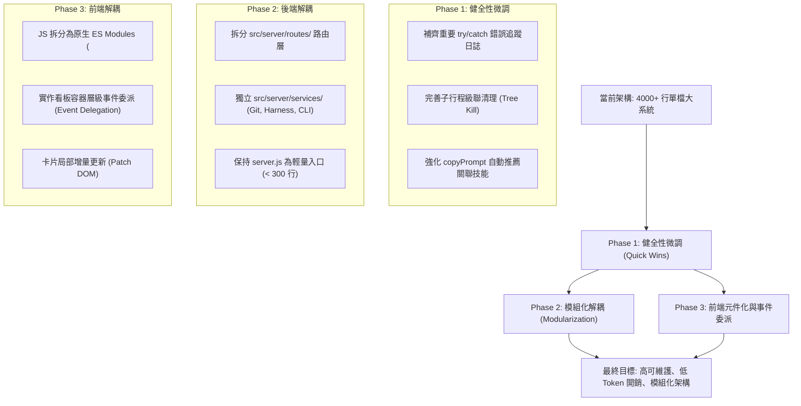

# Task Dashboard 架構與品質全面檢閱優化報告 (Architecture & Code Quality Review)

> **評審任務**: [TASK-082] 優化  
> **日期**: 2026-10-02  
> **評審範圍**: 後端服務 (`src/server/server.js`)、前端介面 (`src/public/index.html`)、架構規範與上下文工程 (`AGENTS.md`, `.github/skills/*`)、自動化驗證機制 (`scripts/*`)。

---

## 1. 執行摘要 (Executive Summary)

Task Dashboard 作為跨專案 AI 代理人工作流與任務看板的核心樞紐，在具備原生 Single Source of Truth（Application Support 隔離存取）、3-Phase Gate 門禁、GitNexus 風險防護、Reactive Wakeup 零 Token 哨兵以及多專案即時監控上展現了極高的工程實用性與穩定度。

然而，隨著功能高速迭代（Harness 自動掃描、動態切片解析、Hermes CLI Agent 行程整合、多輪 Feedback 自動閉環、確認門禁），系統累積了若干架構性債務，特別是 **單檔規模過大 (server.js 4085 行 / index.html 4948 行)**、**全域狀態耦合** 與 **大檔定位上下文開銷**。本報告針對目前架構進行系統性體檢，並提出具體且可落地的優化演進計畫。

---

## 2. 現況架構盤點與潛在風險 (Architecture & Code Review)

### 2.1 後端架構體檢 (`src/server/server.js`: 4,085 行)

| 檢驗面向 | 現況評估 | 潛在風險與痛點 | 具體優化建議 |
| :--- | :--- | :--- | :--- |
| **職責單一性 (SRP)** | 單一檔案包含 HTTP 路由、進程守護、Git/Harness 掃描、檔案 I/O、Commit 產生器與 SSE 即時推播 | 職責過度混雜，AI 修改或審閱時上下文負荷極高，增加跨功能回退風險 | 建議逐步採策略模式拆分為模組： • `routes/` (API 路由) • `services/git.js` (Git Diff & Commit) • `services/harness.js` (Harness 掃描) • `services/cli-agent.js` (Hermes 進程守護) |
| **檔案 I/O 與並行寫入** | 採用同步讀寫 `fs.readFileSync` / `fs.writeFileSync` | 在多任務或高頻率 SSE 更新下可能造成短暫 Event Loop 阻塞或極低機率之寫入競爭 | 引入輕量寫入佇列 (Write Queue / Mutex) 或保留當前的 Atomic Write 機制，確保檔案完整性 |
| **錯誤處理 (Exception Handling)** | 存在多處空的 `catch (e) {}` 靜默吞掉例外 | 檔案存取異常或外部命令失敗時缺乏偵錯軌跡，排查問題難以溯源 | 規範空 catch 補上除錯日誌，或使用統一的 logger 介面分級輸出 (debug/warn/error) |
| **CLI 進程守護與釋放** | 使用 `activeCliProcesses` Map 管理任務行程 | 伺服器異常退出或重啟時，子行程可能殘留成為孤兒行程 (Zombie Process) | 在 `process.on('SIGINT')` 與 `SIGTERM` 中補齊子行程樹的 `tree-kill` 級聯清理 |

### 2.2 前端架構體檢 (`src/public/index.html`: 4,948 行)

| 檢驗面向 | 現況評估 | 潛在風險與痛點 | 具體優化建議 |
| :--- | :--- | :--- | :--- |
| **檔案結構** | 單一 HTML 內嵌 Tailwind CSS、客製樣式與近 4,000 行原生 JavaScript | 檔案超過 4,900 行，若未遵守 grep-n 定位容易觸發 Token 耗盡或閱讀循環 | 將 JS 邏輯依功能抽取為原生 ES Module： • `js/state.js` (資料狀態與快取) • `js/kanban.js` (看板拖曳與卡片渲染) • `js/modal.js` (任務彈窗與表單連動) • `js/api.js` (後端 Fetch 封裝) |
| **DOM 渲染效率** | `renderTasks()` 每次更新皆全量清空並重繪整個看板欄位與卡片 | 任務數量增加 (>50 卡片) 時可能引起不必要的頁面跳動與 Layout Reflow | 引入 Virtual DOM 概念或以 `data-id` 進行局部卡片 Diff 更新 (Patch DOM)，減少重繪 |
| **事件監聽器清理** | 動態產生的卡片大量使用 inline `onclick` 屬性 | 難以統一做事件委派 (Event Delegation)，較不易集中攔截錯誤 | 於看板欄位層級實作事件委派 (`event.target.closest('[data-id]')`)，提升效能並降低記憶體佔用 |
| **XSS 與字串跳脫** | 大部分動態文本有經 `escapeHtml()` 處理 | 部分屬性與 Markdown 解析仍需嚴格確保防止未跳脫字串注入 | 統一以 DOM API (`textContent`) 或消毒函式取代直接拼接 HTML 字串 |

### 2.3 上下文工程與 AI 協同體檢 (`AGENTS.md` & `.github/skills/*`)

| 檢驗面向 | 現況評估 | 成果與後續強化 |
| :--- | :--- | :--- |
| **大檔檢索防 Loop 門禁** | 已正式訂立「大檔 > 500 行禁整檔全覽、grep-n 定位、檢索上限 2 次、Fast-Track 分流」 | 效果顯著，AI 已不再整檔全覽。後續可將此防護機制固化於預置腳本或 CLI 工具輔助。 |
| **技能庫覆蓋度** | 已新增 `code-review-and-quality`、`debugging-and-error-recovery`、`context-engineering` 等 6 大技能 | 技能文檔完整。建議在任務提示詞 (copyPrompt) 中依任務標籤自動動態推薦啟用對應之 Skill。 |
| **需確認後執行門禁 (Execution Plan)** | 已於 TASK-078/TASK-082 完善：需先有 executionPlan 才進入待確認，哨兵過濾待確認任務避免早跳 | 流程已完全閉環，成功防止使用者未確認前 AI 搶跑實作。 |

---

## 3. 具體優化實施藍圖 (Phased Roadmap)

---

## 4. 驗證與回退防護 (Verification & Safety)

1. **Harness 規範檢查**: 任何架構異動均須通過 `npm run harness:check`（關鍵檔案、JSON 格式、macOS 工具鏈、Node 環境、全量 Diff 完整性）。
2. **自動化整合與單元測試**: 執行 `npm test`（含 8 組測試項目：API 路由、靜態託管、Commit 產生、切片隔離、Feedback 消耗、確認門禁）。
3. **無副作用保證**: 解耦重構過程嚴禁變更現有資料庫結構 (`tasks.json`, `projects.json`) 與對外 API 介面協議，確保外部腳本與原生 macOS 外殼相容。
