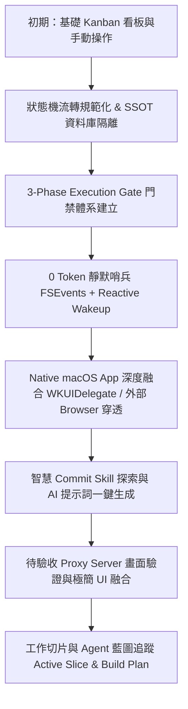
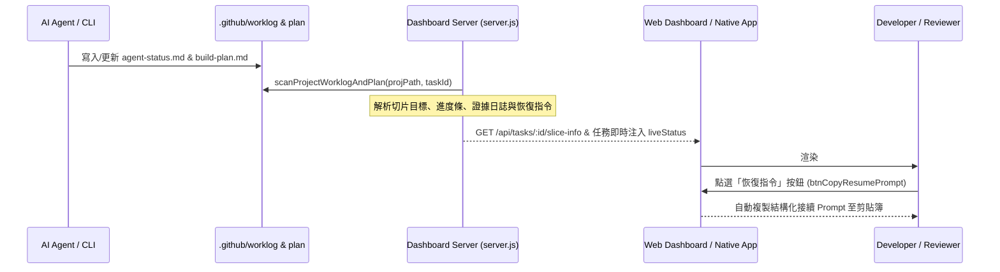

# 🚀 Task Dashboard 開發歷程與技術回顧 (Retrospective)

> **版本週期**：TASK-001 ~ TASK-014  
> **核心主題**：打造以 Ticket-driven 為核心的 AI 代理人自動化開發與審查樞紐  
> **參與專案**：`task-dashboard`、`fetnet-eservice-f2e`、`tool-static-portal`、`service-mobilecircle-inline-page`

---

## 📑 目錄
1. [🌟 全景演進與核心里程碑](#1-全景演進與核心里程碑)
2. [📋 跨專案任務歷程盤點 (TASK-001 ~ TASK-014)](#2-跨專案任務歷程盤點-task-001--task-014)
3. [💡 關鍵技術突破與架構決策](#3-關鍵技術突破與架構決策)
4. [🔍 Retro 反思 (Good, Pain Points, Lessons Learned)](#4-retro-反思-good-pain-points-lessons-learned)
5. [🎯 下一步行動建議 (Action Items)](#5-下一步行動建議-action-items)

---

## 1. 全景演進與核心里程碑

### 關鍵里程碑進程
1. **Single Source of Truth (SSOT) 資料庫解耦**：
   - 確立以 `~/Library/Application Support/TaskDashboard/` 為唯一執行期資料庫，專案倉庫內 `data/` 僅為初始化藍本，徹底杜絕跨專案污染與 Git 追蹤雜訊。
2. **3-Phase Execution Gate 門禁標準化**：
   - 定義 **Phase 1 (Pre-Flight & Feedback Ingestion)**、**Phase 2 (Rule-Compliant Implementation)**、**Phase 3 (Compliance Manifest & Review Promotion)** 執行 SOP。
   - 建立包含已追蹤與未追蹤檔案之**全量無截斷 Git Diff 收集機制**。
3. **0 Token 靜默哨兵 (FSEvents + Reactive Wakeup)**：
   - 捨棄高 CPU 與 Token 消耗的定時輪詢，改用 Node.js 原生 `fs.watch` 監聽 `tasks.json`。檢測到 `in_progress` 瞬間 `exit(0)`，觸發系統 Reactive Wakeup 自動開工。
4. **原生 macOS App 與 WebKit 雙向整合**：
   - 透過 `main.m` Cocoa 輕量原生外殼，支援自動啟動/銷毀後端 Server、原生 `NSOpenPanel` 目錄選擇、外部瀏覽器穿透喚醒，以及 `WKUIDelegate` 原生對話框適配。
5. **Commit Skill 探測與 AI 提示詞生成**：
   - 自動探索目標專案的 Git Commit 相關 Skill，結合 Diff 與變更歷史推導 scope，一鍵複製標準化提示詞。
6. **極簡驗收導向 Proxy Server 整合**：
   - 整合 Proxy Server 驗證流程，將編輯機制融入目標網址呈現列，右上角保留醒目的一鍵開啟按鈕。
7. **工作切片與 Agent 藍圖追蹤 (Active Slice & Build Plan 深度整合)**：
   - 解析專案內的 `.github/worklog/agent-status.md` 與 `.github/harness/plan/*-build-plan.md`，即時在看板呈現當前切片目標、執行步驟、驗收證據與藍圖切片清單，並提供一鍵中斷恢復指令。

---

## 2. 跨專案任務歷程盤點 (TASK-001 ~ TASK-014)

| 任務編號 | 專案名稱 | 類型 | 核心內容與成果 | 審查迭代次數 (Feedbacks) |
|---|---|---|---|---|
| **TASK-001** | `task-dashboard` | UI / Fix | 移除重複的 ProjectBanner，將路徑資訊平滑移至頂部 Header，優化空間佈局。 | 0 輪 |
| **TASK-002** | `fetnet-eservice-f2e` | Frontend | 複製並重構 `FormBannerNew`，修正行動端樣式（移除背景/高度、保留 padding、RWD 顏色與 position: static）。 | 3 輪 |
| **TASK-003** | `fetnet-eservice-f2e` | Frontend | 移除代收設定與查詢交易中所有殘留的「載入中...」文字，改為純動畫載入。 | 1 輪 |
| **TASK-004** | `tool-static-portal` | Fullstack | 增加身障解除綁定 API (`ADMIN.unbindDisability`)，調整身障帳號與灰名單狀態呈現、按鈕位置與單元測試。 | 4 輪 |
| **TASK-005** | `service-mobilecircle-inline-page` | Prototype | 建立 prototype.html 獨立試寫檔案，隔離既有正式頁面代碼。 | 1 輪 |
| **TASK-006** | `task-dashboard` | Architecture | 研議並確立狀態機流轉準則（Diff 作為產物而非觸發條件、顯式完工信號、產物重置隔離）。 | 1 輪 |
| **TASK-007** | `task-dashboard` | UI / A11y | 全局提升字級 2px，重構排版行高，提升長時間工作閱讀舒適度。 | 0 輪 |
| **TASK-008** | `tool-static-portal` | Logic / Refactor | 優化身障帳號判斷邏輯相容性 (`isDisabilityAccount`) 與資料欄位回退 fallback。 | 0 輪 |
| **TASK-009** | `service-mobilecircle-inline-page` | Prototype | prototype.html 實作自動帶入 mock data 機制，支援 staging 快速驗證。 | 0 輪 |
| **TASK-010** | `task-dashboard` | UX | 新增任務彈窗優化：預設所屬專案為空，避免開發者不慎建立在非預期專案中。 | 1 輪 |
| **TASK-011** | `task-dashboard` | UX / Feature | 將低使用率的立即指派按鈕改為「開工引擎」Popover，整合自動化設定與指標卡層級。 | 1 輪 |
| **TASK-012** | `task-dashboard` | Feature / Native | 待驗收任務整合 Proxy Server 網址驗證；實作 macOS 外部瀏覽器喚醒與原生 prompt 彈窗；精簡編輯按鈕並融入網址行。 | 4 輪 |
| **TASK-013** | `task-dashboard` | Feature / AI | 智慧探測目標專案 Commit Skill，推導 scope，提供 AI 提示詞一鍵生成與複製功能；提升 Commit Modal z-index 解決遮擋。 | 2 輪 |
| **TASK-014** | `task-dashboard` | Feature & Docs | 整合 Worklog 與 Build Plan 切片追蹤機制（前端切片卡片、恢復指令、後端解析器與 API）、盤點全量修改歷程並產出完整 Retrospective 報告。 | 0 輪 |

---

## 3. 關鍵技術突破與架構決策

### 3.1 0 Token 靜默哨兵 (Reactive Wakeup 閉環)
- **問題**：過去定時輪詢（Polling）會持續產生排程訊息，浪費 Token、污染對話歷史且有 1~2 分鐘延遲。
- **突破**：利用 Node.js `fs.watch` 監聽檔案系統事件。無任務時 Node.js 行程僅佔用極低記憶體；一旦偵測到 `in_progress`，立即 `process.exit(0)`，觸發 Antigravity 的 Reactive Wakeup 秒級喚醒對話視窗。

### 3.2 嚴格 3-Phase Execution Gate
- **Phase 1 (Pre-Flight)**：優先吸收 `task.feedback`，確保使用者意見得到 100% 響應。
- **Phase 2 (Implementation)**：本機隔離實作，禁止跨專案副作用。
- **Phase 3 (Review Promotion)**：採集完整 Diff（已追蹤 + 未追蹤），自動將 feedback 歸檔至 description 歷史區塊，確保上下文不遺失。

### 3.3 原生 macOS WebKit 與系統穿透
- **外部瀏覽器穿透**：後端新增 `/api/open-browser` 配合系統 `open` 指令，解決 WKWebView 內部跳轉造成 SPA 面板被覆蓋的問題。
- **原生對話框適配**：在 `main.m` 實作 `WKUIDelegate` 的 `webView:runJavaScriptTextInputPanelWithPrompt:...`，使用 `NSAlert` + `NSTextField` 支援原生 `window.prompt()`。
- **自動部署**：`build_app.sh` 編譯後自動覆蓋至 `/Applications/TaskDashboard.app`，讓每次更新即時反映在系統應用程式中。

### 3.4 UI 空間與層級架構優化
- **開工引擎 Popover**：收納複雜的 CLI / AI 自動化設定，釋放 Header 空間。
- **z-index 階層標準化**：修正 Commit 彈窗被任務詳情彈窗覆蓋的層級衝突（提升至 `z-[90]`）。
- **驗收卡片視覺精簡**：移除冗餘編輯按鈕，將編輯觸發融合於目標網址列中，視覺更為乾淨。

### 3.5 工作切片與藍圖追蹤深度實踐 (Active Slice & Build Plan Architecture)

#### 3.5.1 背景與問題根因 (The "Black-Box Agent" Dilemma)
- **黑盒子困境**：在複雜架構或大規模重構任務中，AI Agent 在 `in_progress` 狀態下可能連續執行 10~30 分鐘。過去看板僅能顯示單純的「CLI Agent 正在執行中...」或終端機末尾片段，使用者無從得知：
  1. 目前任務被拆解為哪些子切片（Slices）？已完成幾項？
  2. 當前切片的具體業務目標（Current Slice Goal）與邊界（In/Out Scope）為何？
  3. 切片驗收標準（Acceptance Criteria）與驗證證據（Evidence）是否已被確實記錄？
- **中斷恢復成本高昂**：若任務因 Context Window 限制、Token 超標或突發錯誤中斷，開發者重新下 Prompt 往往需手動翻找歷史日誌，極易遺漏上下文或重複已實作的部分。

#### 3.5.2 雙核藍圖契約規範 (Dual-Contract Specification)
本專案深度整合兩種工件規格，達成靜態藍圖與動態日誌的雙向同步：
1. **靜態建置藍圖 (`.github/harness/plan/*-build-plan.md`)**：
   - **Task Card 核心中繼資料**：定義 `Task ID`、`Route`、`Task Goal`、`In/Out Scope`、`Acceptance Criteria` 與 `Resume Entry`。
   - **切片清單 (Slices Pipeline)**：以標準 Markdown 清單維護 `[x]` (已交付)、`[-]` (當前切片)、`[ ]` (待推進)，包含各切片之變更目標與驗證命令。
2. **動態代理人狀態 (`.github/worklog/agent-status.md`)**：
   - **即時執行狀態**：即時記錄 `Active Task`、`Current Step`、`Evidence`、`Updated Files`、`Next Step`。
   - **歷史銜接**：維護 `Last Completed Task`，提供跨任務切換時的上下文緩衝。

#### 3.5.3 端到端運作機制與技術實作 (End-to-End Pipeline)

1. **多格式寬容度解析引擎 (`server.js`)**：
   - `parseAgentStatusContent()`：支援中英文冒號（`:` / `：`）、忽略大小寫欄位匹配，容錯解析非標準格式的 agent 輸出。
   - `parseBuildPlanContent()`：以正則動態萃取 Task Card 區塊與 Markdown Checkbox 切片清單，自動推導已完成數、進行中切片與剩餘切片。
   - `scanProjectWorklogAndPlan()`：多藍圖自動優先權排序（依檔案 `mtimeMs` 倒序），並依 `taskId` 進行智能關聯匹配。
2. **即時動態狀態注入 (Live Status Hydration)**：
   - 任務處於 `in_progress` 時，後端自動將工作日誌萃取出的 `currentStep` 或 `currentSliceGoal` 映射為看板卡片的最新狀態，並將 `evidence` 注入 `liveStatus.recentTail`，使看板在未開彈窗的情況下即可即時看見切片驗證進度。
3. **前端高密度可視化 Modal 元件 (`index.html`)**：
   - **Header 區**：切片藍圖檔名 Badge、路由 Badge、以及一鍵複製按鈕。
   - **目標卡片區**：明確高亮本輪切片目標與 In/Out Scope 邊界。
   - **執行追蹤區**：呈現綠色高亮的「當前步驟」與 Slate 深色代碼風格的「驗收證據 (Evidence)」。
   - **藍圖切片清單區**：以動態清單視覺化所有子切片，搭配綠色打勾 (已完成)、藍色脈衝圖示 (進行中) 與未完成項目。
4. **一鍵恢復提示詞產生器 (`copyResumePromptFromModal`)**：
   - 自動將「目標專案路徑」、「Active Task ID」、「藍圖檔案路徑」、「當前路由」、「本輪切片目標」、「下一個切片待辦事項」與「接續入口指令」組合為結構化的標準 Prompt，使開發者在遇到中斷時僅需點擊一下即可無縫無損喚醒 Agent 繼續執行。

---

## 4. 🔍 Retro 反思 (Good, Pain Points, Lessons Learned)

### 🌟 What Went Well (做得好的地方)
1. **端到端閉環流暢**：從看板拖曳任務、哨兵喚醒、AI 讀取規範、修改程式碼、跑測試、全量 Diff 收集到推入 Review，整套 Ticket-driven 工作流高度順暢。
2. **多專案隔離嚴格**：同時支援 4 個不同技術棧專案（Vanilla/Node.js、React+Redux、Vue2+Vuetify、靜態 HTML），未發生跨專案污染。
3. **Feedback 閉環機制健全**：歷次審查意見自動追加至 description 歷史欄位，避免 AI 在多輪修正中遺失原始上下文。
4. **輕量極速的原生 App**：不依賴肥大的 Electron 或 Xcode 專案，單純用 `clang` 編譯 Objective-C 原生外殼，秒級建置且效能極高。
5. **細粒度進度透明度**：切片與藍圖追蹤功能讓複雜任務不再是黑盒子，大幅降低人機協同過程中的資訊不對稱。

### ⚠️ Pain Points & Challenges (遇到的痛點與挑戰)
1. **macOS 沙盒與權限差異**：
   - 終端機預設沙盒環境限制存取 `~/Library/Application Support/` 與當前工作目錄（EPERM），需明確配置 `BypassSandbox: true`。
2. **原生 WebKit 預設行為差異**：
   - WKWebView 預設不支援 `window.prompt`、點擊外部連結預設在 WebKit 內部導航而非呼叫系統預設瀏覽器，需在原生外殼中補齊 Delegate 實作。
3. **多輪 Feedback 溝通成本**：
   - 少數任務（如 TASK-004、TASK-012）歷經 3~4 輪 Feedback 才完全對齊需求，反映初始需求描述若能附帶具體驗收標準（Acceptance Criteria），可大幅降低迭代次數。

### 💡 Lessons Learned (核心經驗收穫)
1. **SSOT 原則是多專案樞紐的基石**：將資料庫與專案倉庫完全隔離，是維持 AI 協作乾淨度的最關鍵設計。
2. **UI 簡約原則（Less is More）**：低使用率的功能應適度隱藏或融合（如 Popover、網址點擊自訂），避免將所有功能做成獨立按鈕造成介面雜亂。
3. **主動防禦式測試**：每次交付前跑齊 `npm test` 與 `npm run harness:check`，能有效攔截 95% 以上的低級錯誤。

---

## 5. 🎯 下一步行動建議 (Action Items)

| 優先級 | 項目 | 預期效益 | 規劃方向 |
|---|---|---|---|
| **P1** | **Feedback 快速範本與退回理由** | 加速審查溝通 | 在 Review 介面提供常用 Feedback 快速標籤（如「補單元測試」、「樣式微調」、「請執行 git stash」）。 |
| **P1** | **切片進度條與逾時預警** | 預防長任務卡滯 | 在看板卡片直接呈現切片進度條 (如 2/5 Slices)，並針對單一切片逾時未推進時發出警告標籤。 |
| **P1** | **測試覆蓋率自動報告** | 強化交付品質 | 在 Phase 3 自動收集單元測試覆蓋率並顯示於 Execution Log。 |
| **P2** | **多 Agent 協作狀態看板** | 提升協同可視度 | 支援多個 AI Agent 同時認領不同專案任務的即時狀態監控。 |
| **P2** | **自動 Git Commit / PR 整合** | 串連最後一哩路 | 在 Review 驗收通過後，提供一鍵由後端執行 Git Commit 與建立 Pull Request 的功能。 |
| **P3** | **暗黑模式微調與自訂主題** | 改善視覺體驗 | 提供更多現代主題配色方案與程式碼高亮風格選擇。 |

---
*Retrospective Report generated at 2026-09-09 by Antigravity.*
