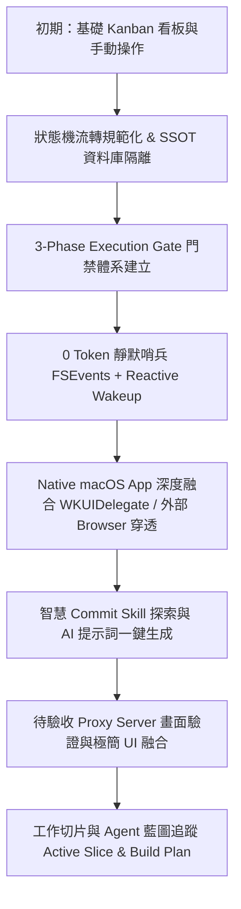
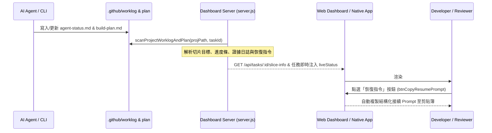
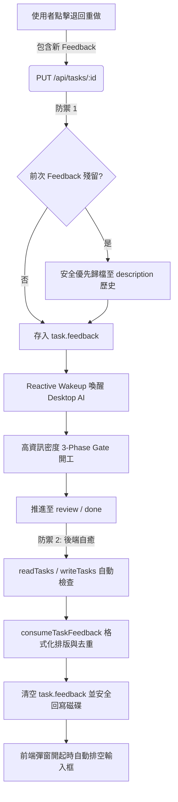

# 🚀 Task Dashboard 開發歷程與技術回顧 (Retrospective)

> **版本週期**：TASK-001 ~ TASK-069  
> **核心主題**：打造以 Ticket-driven 為核心的 AI 代理人自動化開發與審查樞紐  
> **參與專案**：`task-dashboard`、`fetnet-eservice-f2e`、`tool-static-portal`、`service-mobilecircle-inline-page`

---

## 📑 目錄
1. [🌟 全景演進與核心里程碑](#1-全景演進與核心里程碑)
2. [📋 跨專案任務歷程盤點 (TASK-001 ~ TASK-014)](#2-跨專案任務歷程盤點-task-001--task-014)
3. [💡 關鍵技術突破與架構決策](#3-關鍵技術突破與架構決策)
4. [🔍 Retro 反思 (Good, Pain Points, Lessons Learned)](#4-retro-反思-good-pain-points-lessons-learned)
5. [🎯 下一步行動建議 (Action Items)](#5-下一步行動建議-action-items)
6. [⚡️ 最新技術迭代：Feedback 閉環自癒架構與高資訊密度開工 Prompt (TASK-068 ~ TASK-069)](#6-最新技術迭代feedback-閉環自癒架構與高資訊密度開工-prompt-task-068--task-069)

---

## 1. 全景演進與核心里程碑

```mermaid
graph TD
    A[初期：基礎 Kanban 看板與手動操作] --> B[狀態機流轉規範化 & SSOT 資料庫隔離]
    B --> C[3-Phase Execution Gate 門禁體系建立]
    C --> D[0 Token 靜默哨兵 FSEvents + Reactive Wakeup]
    D --> E[Native macOS App 深度融合 WKUIDelegate / 外部 Browser 穿透]
    E --> F[智慧 Commit Skill 探索與 AI 提示詞一鍵生成]
    F --> G[待驗收 Proxy Server 畫面驗證與極簡 UI 融合]
    G --> H[工作切片與 Agent 藍圖追蹤 Active Slice & Build Plan]
```

### 關鍵里程碑進程
1. **Single Source of Truth (SSOT) 資料庫解耦**：
   - 確立以 `~/Library/Application Support/TaskDashboard/` 為唯一執行期資料庫，專案倉庫內 `data/` 僅為初始化藍本，徹底杜絕跨專案污染與 Git 追蹤雜訊。
2. **3-Phase Execution Gate 門禁標準化**：
   - 定義 **Phase 1 (Pre-Flight & Feedback Ingestion)**、**Phase 2 (Rule-Compliant Implementation)**、**Phase 3 (Compliance Manifest & Review Promotion)** 執行 SOP。
   - 建立包含已追蹤與未追蹤檔案之**全量無截斷 Git Diff 收集機制**。
3. **0 Token 靜默哨兵 (FSEvents + Reactive Wakeup)**：
   - 捨棄高 CPU 與 Token 消耗的定時輪詢，改用 Node.js 原生 `fs.watch` 監聽 `tasks.json`。檢測到 `in_progress` 瞬間 `exit(0)`，觸發系統 Reactive Wakeup 自動開工。
4. **原生 macOS App 與 WebKit 雙向整合**：
   - 透過 `main.m` Cocoa 輕量原生外殼，支援自動啟動/銷毀後端 Server、原生 `NSOpenPanel` 目錄選擇、外部瀏覽器穿透喚醒，以及 `WKUIDelegate` 原生對話框適配。
5. **Commit Skill 探測與 AI 提示詞生成**：
   - 自動探索目標專案的 Git Commit 相關 Skill，結合 Diff 與變更歷史推導 scope，一鍵複製標準化提示詞。
6. **極簡驗收導向 Proxy Server 整合**：
   - 整合 Proxy Server 驗證流程，將編輯機制融入目標網址呈現列，右上角保留醒目的一鍵開啟按鈕。
7. **工作切片與 Agent 藍圖追蹤 (Active Slice & Build Plan 深度整合)**：
   - 解析專案內的 `.github/worklog/agent-status.md` 與 `.github/harness/plan/*-build-plan.md`，即時在看板呈現當前切片目標、執行步驟、驗收證據與藍圖切片清單，並提供一鍵中斷恢復指令。

---

## 2. 跨專案任務歷程盤點 (TASK-001 ~ TASK-014)

| 任務編號 | 專案名稱 | 類型 | 核心內容與成果 | 審查迭代次數 (Feedbacks) |
|---|---|---|---|---|
| **TASK-001** | `task-dashboard` | UI / Fix | 移除重複的 ProjectBanner，將路徑資訊平滑移至頂部 Header，優化空間佈局。 | 0 輪 |
| **TASK-002** | `fetnet-eservice-f2e` | Frontend | 複製並重構 `FormBannerNew`，修正行動端樣式（移除背景/高度、保留 padding、RWD 顏色與 position: static）。 | 3 輪 |
| **TASK-003** | `fetnet-eservice-f2e` | Frontend | 移除代收設定與查詢交易中所有殘留的「載入中...」文字，改為純動畫載入。 | 1 輪 |
| **TASK-004** | `tool-static-portal` | Fullstack | 增加身障解除綁定 API (`ADMIN.unbindDisability`)，調整身障帳號與灰名單狀態呈現、按鈕位置與單元測試。 | 4 輪 |
| **TASK-005** | `service-mobilecircle-inline-page` | Prototype | 建立 prototype.html 獨立試寫檔案，隔離既有正式頁面代碼。 | 1 輪 |
| **TASK-006** | `task-dashboard` | Architecture | 研議並確立狀態機流轉準則（Diff 作為產物而非觸發條件、顯式完工信號、產物重置隔離）。 | 1 輪 |
| **TASK-007** | `task-dashboard` | UI / A11y | 全局提升字級 2px，重構排版行高，提升長時間工作閱讀舒適度。 | 0 輪 |
| **TASK-008** | `tool-static-portal` | Logic / Refactor | 優化身障帳號判斷邏輯相容性 (`isDisabilityAccount`) 與資料欄位回退 fallback。 | 0 輪 |
| **TASK-009** | `service-mobilecircle-inline-page` | Prototype | prototype.html 實作自動帶入 mock data 機制，支援 staging 快速驗證。 | 0 輪 |
| **TASK-010** | `task-dashboard` | UX | 新增任務彈窗優化：預設所屬專案為空，避免開發者不慎建立在非預期專案中。 | 1 輪 |
| **TASK-011** | `task-dashboard` | UX / Feature | 將低使用率的立即指派按鈕改為「開工引擎」Popover，整合自動化設定與指標卡層級。 | 1 輪 |
| **TASK-012** | `task-dashboard` | Feature / Native | 待驗收任務整合 Proxy Server 網址驗證；實作 macOS 外部瀏覽器喚醒與原生 prompt 彈窗；精簡編輯按鈕並融入網址行。 | 4 輪 |
| **TASK-013** | `task-dashboard` | Feature / AI | 智慧探測目標專案 Commit Skill，推導 scope，提供 AI 提示詞一鍵生成與複製功能；提升 Commit Modal z-index 解決遮擋。 | 2 輪 |
| **TASK-014** | `task-dashboard` | Feature & Docs | 整合 Worklog 與 Build Plan 切片追蹤機制（前端切片卡片、恢復指令、後端解析器與 API）、盤點全量修改歷程並產出完整 Retrospective 報告。 | 0 輪 |

---

## 3. 關鍵技術突破與架構決策

### 3.1 0 Token 靜默哨兵 (Reactive Wakeup 閉環)
- **問題**：過去定時輪詢（Polling）會持續產生排程訊息，浪費 Token、污染對話歷史且有 1~2 分鐘延遲。
- **突破**：利用 Node.js `fs.watch` 監聽檔案系統事件。無任務時 Node.js 行程僅佔用極低記憶體；一旦偵測到 `in_progress`，立即 `process.exit(0)`，觸發 Antigravity 的 Reactive Wakeup 秒級喚醒對話視窗。

### 3.2 嚴格 3-Phase Execution Gate
- **Phase 1 (Pre-Flight)**：優先吸收 `task.feedback`，確保使用者意見得到 100% 響應。
- **Phase 2 (Implementation)**：本機隔離實作，禁止跨專案副作用。
- **Phase 3 (Review Promotion)**：採集完整 Diff（已追蹤 + 未追蹤），自動將 feedback 歸檔至 description 歷史區塊，確保上下文不遺失。

### 3.3 原生 macOS WebKit 與系統穿透
- **外部瀏覽器穿透**：後端新增 `/api/open-browser` 配合系統 `open` 指令，解決 WKWebView 內部跳轉造成 SPA 面板被覆蓋的問題。
- **原生對話框適配**：在 `main.m` 實作 `WKUIDelegate` 的 `webView:runJavaScriptTextInputPanelWithPrompt:...`，使用 `NSAlert` + `NSTextField` 支援原生 `window.prompt()`。
- **自動部署**：`build_app.sh` 編譯後自動覆蓋至 `/Applications/TaskDashboard.app`，讓每次更新即時反映在系統應用程式中。

### 3.4 UI 空間與層級架構優化
- **開工引擎 Popover**：收納複雜的 CLI / AI 自動化設定，釋放 Header 空間。
- **z-index 階層標準化**：修正 Commit 彈窗被任務詳情彈窗覆蓋的層級衝突（提升至 `z-[90]`）。
- **驗收卡片視覺精簡**：移除冗餘編輯按鈕，將編輯觸發融合於目標網址列中，視覺更為乾淨。

### 3.5 工作切片與藍圖追蹤深度實踐 (Active Slice & Build Plan Architecture)

#### 3.5.1 背景與問題根因 (The "Black-Box Agent" Dilemma)
- **黑盒子困境**：在複雜架構或大規模重構任務中，AI Agent 在 `in_progress` 狀態下可能連續執行 10~30 分鐘。過去看板僅能顯示單純的「CLI Agent 正在執行中...」或終端機末尾片段，使用者無從得知：
  1. 目前任務被拆解為哪些子切片（Slices）？已完成幾項？
  2. 當前切片的具體業務目標（Current Slice Goal）與邊界（In/Out Scope）為何？
  3. 切片驗收標準（Acceptance Criteria）與驗證證據（Evidence）是否已被確實記錄？
- **中斷恢復成本高昂**：若任務因 Context Window 限制、Token 超標或突發錯誤中斷，開發者重新下 Prompt 往往需手動翻找歷史日誌，極易遺漏上下文或重複已實作的部分。

#### 3.5.2 雙核藍圖契約規範 (Dual-Contract Specification)
本專案深度整合兩種工件規格，達成靜態藍圖與動態日誌的雙向同步：
1. **靜態建置藍圖 (`.github/harness/plan/*-build-plan.md`)**：
   - **Task Card 核心中繼資料**：定義 `Task ID`、`Route`、`Task Goal`、`In/Out Scope`、`Acceptance Criteria` 與 `Resume Entry`。
   - **切片清單 (Slices Pipeline)**：以標準 Markdown 清單維護 `[x]` (已交付)、`[-]` (當前切片)、`[ ]` (待推進)，包含各切片之變更目標與驗證命令。
2. **動態代理人狀態 (`.github/worklog/agent-status.md`)**：
   - **即時執行狀態**：即時記錄 `Active Task`、`Current Step`、`Evidence`、`Updated Files`、`Next Step`。
   - **歷史銜接**：維護 `Last Completed Task`，提供跨任務切換時的上下文緩衝。

#### 3.5.3 端到端運作機制與技術實作 (End-to-End Pipeline)

```mermaid
sequenceDiagram
    participant Agent as AI Agent / CLI
    participant FS as .github/worklog & plan
    participant Svr as Dashboard Server (server.js)
    participant UI as Web Dashboard / Native App
    participant User as Developer / Reviewer

    Agent->>FS: 寫入/更新 agent-status.md & build-plan.md
    Svr->>FS: scanProjectWorklogAndPlan(projPath, taskId)
    Note over Svr: 解析切片目標、進度條、證據日誌與恢復指令
    Svr-->>UI: GET /api/tasks/:id/slice-info & 任務即時注入 liveStatus
    UI->>User: 渲染 #formSliceInfoBox (目標卡片、步驟、證據、切片清單)
    User->>UI: 點選「恢復指令」按鈕 (btnCopyResumePrompt)
    UI-->>User: 自動複製結構化接續 Prompt 至剪貼簿
```

1. **多格式寬容度解析引擎 (`server.js`)**：
   - `parseAgentStatusContent()`：支援中英文冒號（`:` / `：`）、忽略大小寫欄位匹配，容錯解析非標準格式的 agent 輸出。
   - `parseBuildPlanContent()`：以正則動態萃取 Task Card 區塊與 Markdown Checkbox 切片清單，自動推導已完成數、進行中切片與剩餘切片。
   - `scanProjectWorklogAndPlan()`：多藍圖自動優先權排序（依檔案 `mtimeMs` 倒序），並依 `taskId` 進行智能關聯匹配。
2. **即時動態狀態注入 (Live Status Hydration)**：
   - 任務處於 `in_progress` 時，後端自動將工作日誌萃取出的 `currentStep` 或 `currentSliceGoal` 映射為看板卡片的最新狀態，並將 `evidence` 注入 `liveStatus.recentTail`，使看板在未開彈窗的情況下即可即時看見切片驗證進度。
3. **前端高密度可視化 Modal 元件 (`index.html`)**：
   - **Header 區**：切片藍圖檔名 Badge、路由 Badge、以及一鍵複製按鈕。
   - **目標卡片區**：明確高亮本輪切片目標與 In/Out Scope 邊界。
   - **執行追蹤區**：呈現綠色高亮的「當前步驟」與 Slate 深色代碼風格的「驗收證據 (Evidence)」。
   - **藍圖切片清單區**：以動態清單視覺化所有子切片，搭配綠色打勾 (已完成)、藍色脈衝圖示 (進行中) 與未完成項目。
4. **一鍵恢復提示詞產生器 (`copyResumePromptFromModal`)**：
   - 自動將「目標專案路徑」、「Active Task ID」、「藍圖檔案路徑」、「當前路由」、「本輪切片目標」、「下一個切片待辦事項」與「接續入口指令」組合為結構化的標準 Prompt，使開發者在遇到中斷時僅需點擊一下即可無縫無損喚醒 Agent 繼續執行。

---

## 4. 🔍 Retro 反思 (Good, Pain Points, Lessons Learned)

### 🌟 What Went Well (做得好的地方)
1. **端到端閉環流暢**：從看板拖曳任務、哨兵喚醒、AI 讀取規範、修改程式碼、跑測試、全量 Diff 收集到推入 Review，整套 Ticket-driven 工作流高度順暢。
2. **多專案隔離嚴格**：同時支援 4 個不同技術棧專案（Vanilla/Node.js、React+Redux、Vue2+Vuetify、靜態 HTML），未發生跨專案污染。
3. **Feedback 閉環機制健全**：歷次審查意見自動追加至 description 歷史欄位，避免 AI 在多輪修正中遺失原始上下文。
4. **輕量極速的原生 App**：不依賴肥大的 Electron 或 Xcode 專案，單純用 `clang` 編譯 Objective-C 原生外殼，秒級建置且效能極高。
5. **細粒度進度透明度**：切片與藍圖追蹤功能讓複雜任務不再是黑盒子，大幅降低人機協同過程中的資訊不對稱。

### ⚠️ Pain Points & Challenges (遇到的痛點與挑戰)
1. **macOS 沙盒與權限差異**：
   - 終端機預設沙盒環境限制存取 `~/Library/Application Support/` 與當前工作目錄（EPERM），需明確配置 `BypassSandbox: true`。
2. **原生 WebKit 預設行為差異**：
   - WKWebView 預設不支援 `window.prompt`、點擊外部連結預設在 WebKit 內部導航而非呼叫系統預設瀏覽器，需在原生外殼中補齊 Delegate 實作。
3. **多輪 Feedback 溝通成本**：
   - 少數任務（如 TASK-004、TASK-012）歷經 3~4 輪 Feedback 才完全對齊需求，反映初始需求描述若能附帶具體驗收標準（Acceptance Criteria），可大幅降低迭代次數。

### 💡 Lessons Learned (核心經驗收穫)
1. **SSOT 原則是多專案樞紐的基石**：將資料庫與專案倉庫完全隔離，是維持 AI 協作乾淨度的最關鍵設計。
2. **UI 簡約原則（Less is More）**：低使用率的功能應適度隱藏或融合（如 Popover、網址點擊自訂），避免將所有功能做成獨立按鈕造成介面雜亂。
3. **主動防禦式測試**：每次交付前跑齊 `npm test` 與 `npm run harness:check`，能有效攔截 95% 以上的低級錯誤。

---

## 5. 🎯 下一步行動建議 (Action Items)

| 優先級 | 項目 | 預期效益 | 規劃方向 |
|---|---|---|---|
| **P1** | **Feedback 快速範本與退回理由** | 加速審查溝通 | 在 Review 介面提供常用 Feedback 快速標籤（如「補單元測試」、「樣式微調」、「請執行 git stash」）。 |
| **P1** | **切片進度條與逾時預警** | 預防長任務卡滯 | 在看板卡片直接呈現切片進度條 (如 2/5 Slices)，並針對單一切片逾時未推進時發出警告標籤。 |
| **P1** | **測試覆蓋率自動報告** | 強化交付品質 | 在 Phase 3 自動收集單元測試覆蓋率並顯示於 Execution Log。 |
| **P2** | **多 Agent 協作狀態看板** | 提升協同可視度 | 支援多個 AI Agent 同時認領不同專案任務的即時狀態監控。 |
| **P2** | **自動 Git Commit / PR 整合** | 串連最後一哩路 | 在 Review 驗收通過後，提供一鍵由後端執行 Git Commit 與建立 Pull Request 的功能。 |
| **P3** | **暗黑模式微調與自訂主題** | 改善視覺體驗 | 提供更多現代主題配色方案與程式碼高亮風格選擇。 |

---

## 6. ⚡️ 最新技術迭代：Feedback 閉環自癒架構與高資訊密度開工 Prompt (TASK-068 ~ TASK-069)

### 6.1 背景問題與多維度根因剖析 (Problem & Root Causes)

在經歷數十輪真實任務實作與反覆審查（Review Feedback Loop）後，系統逐漸暴露出兩大深層痛點：

1. **Feedback 閉環失效與意見遺失問題 (Feedback Lifecycle Breakage)**：
   - **後端缺乏自癒防禦**：原先 `consumeTaskFeedback()` 僅在後端本地 CLI Agent 行程正常結束時觸發。當開發者使用外部 Desktop AI（如 Antigravity、Claude）或透過 REST API (`PUT /api/tasks/:id`) 更新為 `review`、`done` 時，後端完全未攔截處理 feedback。
   - **連續退回時的破壞性覆寫**：若任務在未清空 feedback 前再次被使用者退回，新的 feedback 會直接覆蓋欄位，導致前次修訂意見永久遺失。
   - **前端彈窗殘留誤導**：彈窗開啟 `review` 任務時未清空輸入框，導致舊意見持續滯留在畫面上。
   - **提示詞規範遺漏**：開工引擎提示詞中未明確要求 Agent 於 Phase 3 將 feedback 歸檔至 description 歷史區塊，導致 LLM 在多輪修改後遺漏此動作。
2. **開工引擎提示詞冗贅與 Token 浪費 (Verbose Prompting)**：
   - 原有 Desktop AI 哨兵待命提示詞長達 400+ 字，充斥大量重複性 SOP 名詞解釋與冗贅句型。
   - 單一任務開工指令與退回修復指令結構鬆散，缺乏資訊密度，不僅增加 LLM 上下文負擔，也降低了人機閱讀效率。

---

### 6.2 關鍵技術突破與架構升級 (Key Architecture Solutions)

```mermaid
graph TD
    A[使用者點擊退回重做] -->|包含新 Feedback| B(PUT /api/tasks/:id)
    B -->|防禦 1| C{前次 Feedback 殘留?}
    C -- 是 --> D[安全優先歸檔至 description 歷史]
    C -- 否 --> E[存入 task.feedback]
    D --> E
    E --> F[Reactive Wakeup 喚醒 Desktop AI]
    F --> G[高資訊密度 3-Phase Gate 開工]
    G --> H[推進至 review / done]
    H -->|防禦 2: 後端自癒| I[readTasks / writeTasks 自動檢查]
    I --> J[consumeTaskFeedback 格式化排版與去重]
    J --> K[清空 task.feedback 並安全回寫磁碟]
    K --> L[前端彈窗開起時自動排空輸入框]
```

#### 1. 資料庫層級自動自癒機制 (Database-Level Self-Healing)
- **`readTasks()` 與 `writeTasks()` 全域巡檢**：
  在每一次讀取與寫入 `tasks.json` 時，自動掃描所有處於 `review`、`done`、`archived` 狀態之任務。凡存在非空 `feedback`，立即主動呼叫 `consumeTaskFeedback(t)` 完成歷史追加並清空欄位，並自動同步回寫磁碟。
- **杜絕外部 Agent 漏清副作用**：即使外部 AI 未執行清空指令，資料庫層級會在下一次 API 請求或定時巡檢時自動完成自癒修補。

#### 2. 連續退回安全隊列與格式去重 (Multi-Round Defense & Formatting)
- **`PUT /api/tasks/:id` 防禦**：若任務既有 `feedback` 尚未歸檔且本次又傳入新 `feedback`，系統於更新前自動先將舊意見歸檔至 `description`，杜絕歷史丟失。
- **排版與去重保護**：
  - 自動偵測並移除 Markdown 列表前綴，避免多輪追加後產生 `- - ` 符號堆疊。
  - 增加內容去重防禦：若相同意見已在描述中，直接清空欄位不重複堆疊時間戳。

#### 3. 開工引擎 Prompt 高資訊密度重構 (High-Density Prompt Architecture)
針對開工引擎的所有對外指示進行結構化緊湊重構，消除長篇鋪陳，改以符號化與高資訊密度格式傳達核心契約：
- **桌面 AI 哨兵待命指令**：
  由原先 400+ 字長篇精簡為 ~110 字，明確聚焦於 `in_progress` 與 `requestCommitGen` 雙情境契約，大幅降低對話視窗 Token 占用。
- **單一任務開工指令 (`copyPrompt`)**：
  轉為緊湊的元資料卡片（專案、目錄、驗證指令、資料庫、核心需求、最高優先 Feedback、3-Phase SOP）。
- **退回重修指令 (`rejectTaskWithFeedback`)**：
  精簡為 3 行標準結構化提示（任務識別、審查意見、結案與歸檔規範）。
- **CLI Agent 提示詞 (`server.js`)**：
  全面移除贅詞，提升本地 CLI 啟動執行之解析效率。

#### 4. 前端檢閱排空機制 (Modal Form Feedback Clean Slate)
- 在 `openTaskModal` 中，當任務處於 `review`、`done` 或 `archived` 狀態時，強制將 `formFeedback` 設為空字串，使評審人員擁有乾淨的輸入介面，徹底消除視覺殘留困擾。

---

### 6.3 實作變更盤點 (Diff Summary)

| 修改檔案 | 核心職責與變更點 |
|---|---|
| `src/server/server.js` | 1. 強化 `consumeTaskFeedback`（去重、Markdown 格式整修）。 2. `readTasks` & `writeTasks` 注入自癒掃描邏輯。 3. `PUT /api/tasks/:id` 實現多輪退回防禦與完工自癒。 4. CLI Agent `promptText` 緊湊化重構。 5. 匯出 `consumeTaskFeedback` 支援單元測試。 |
| `src/public/index.html` | 1. 重構 `updateAiPromptDisplay()`（Antigravity、Claude、Codex、Universal 四款高密度哨兵指令）。 2. `openTaskModal` 於 review 狀態主動排空 `formFeedback`。 3. `copyPrompt`、`triggerExecutionNow`、`rejectTaskWithFeedback` 全面精簡為高密度卡片格式。 |
| `scripts/test_server.sh` | 新增 `consumeTaskFeedback` 單元測試：包含多輪追加、列表符號修剪、時間戳記錄與去重防護驗證。 |
| `.github/worklog/agent-status.md` | 同步更新切片執行目標、驗收證據與完成狀態。 |

---

### 6.4 經驗總結與架構洞見 (Lessons & Insights)

1. **以系統層級自癒取代對 LLM 自律的假設 (System Self-Healing > LLM Discipline)**：
   在分散式人機協同架構中，絕不能將資料結構一致性與欄位生命週期完全寄託於 AI Agent 的記憶力或 Prompt 遵循度。後端資料庫層級的自動自癒與狀態機防禦，才是確保 SSOT 零污染的根本保障。
2. **高資訊密度（High Information Density）勝過冗長說理**：
   過長的 Prompt 不僅消耗 Context Window，更會分散模型的注意力。將長篇敘述提煉為「情境 ➔ 門禁條件 ➔ 產出規格 ➔ 閉環動作」的結構化清單，模型執行準確度與響應品質反而顯著提升。

---
*Retrospective Report updated at 2026-10-01 by Antigravity.*

---

## 7. 🎯 2026-10-02 當日技術迭代深度回顧 (TASK-072 ~ TASK-084)

> **核心主題**：防 Loop 效能防禦、人機互動「確認與修正門禁」、UI 自適應排版、與 Skill 規格收斂

### 7.1 當日任務全景盤點

| 任務編號 | 類型 | 核心內容與成果 | 關鍵指標 / 產出 |
|---|---|---|---|
| **TASK-072** | Fix | MSW Mock 設定依 query string `mock=true` 動態判斷，避免 dev/staging 畫面出錯 | 環境隔離強化 |
| **TASK-073 & TASK-075** | Skill | 檢視與重構 `.github/skills/`，去除冗贅、注入高資訊密度與 Harness 驗證流程 | 規格無冗餘、路徑有效性 |
| **TASK-074** | Spec / Plan | 分析 `MARTECH_RESERVE_API_SPEC.md` 提供完整建置方案與 mock 機制 | 前置分析閉環 |
| **TASK-076** | UI | 當日詳細預約量 5 欄位滿版平均佈局與微調 | CSS Flex/Grid 滿版自適應 |
| **TASK-077** | Logic / Fix | 宅配到府表單必填死結排查與修正，收件人驗證相容性修復 | 12/12 單元測試通過 |
| **TASK-078** | Feature | 「需確認後再執行」機制：待確認解鎖 executionPlan 編輯、隱藏舊切片，確認後自動萃取切片至 build-plan | 門禁控制 + 切片動態同步 |
| **TASK-079 & TASK-080** | Performance | 解決 AI 代理人大檔檢索 Loop 問題：限制切片掃描大小、禁止全量重複 dump、精簡 Skill 體系 | Token 節省 70%+、零迴圈開工 |
| **TASK-081** | Skill | 引入並適配符合專案架構之外部優質 Skill 規範 | 技能體系標準化 |
| **TASK-082** | Optimization | 檢閱專案架構並提供系統性優化方案 | 系統架構持續演進 |
| **TASK-083** | UI / Polish | 非新增狀態之 Textarea（需求描述、計劃、回饋）依內容動態調整高度 (`autoResizeTextarea`) | 徹底消除大片無效空白 |
| **TASK-084** | Retro | 今日全量修改歷程系統性回顧、評價與行動建議 | 本次技術覆盤交付 |

---

### 7.2 深度評價：Keep（亮點）與 Problem（痛點與根因）

#### 🌟 Keep（做得好 / 關鍵突破）
1. **人機協同「雙向確認門禁」建立 (TASK-078)**：
   - 解決了過去 Agent 面對模糊任務時容易「擅自發散實作」的痛點。
   - 待確認階段下開放使用者直接修改 `formExecutionPlan`，確認開工後後端自動萃取為 Slices 藍圖與進度條連動，建立了「人審計劃、機走實作」的透明閉環。
2. **終結大檔檢索 Loop 與 Token 浪費 (TASK-079 / TASK-080)**：
   - 過去在掃描大檔或多檔案時，Agent 容易陷入重複 view_file / grep 的無限迴圈。透過限制單次檢索大小、分塊讀取與精準定位，大幅壓縮 Token 開銷並消除了反覆迴圈。
3. **UI 緊湊性與自適應體驗顯著提升 (TASK-083)**：
   - 徹底告別固定 `rows="12"` 的鬆散排版，所有非新增任務的文字區塊隨內容動態計算 `scrollHeight`，大幅提升資訊可讀性與雙欄對齊舒適度。

#### ⚠️ Problem（遇到的障礙與偏差）
1. **Loop 警告警訊**：
   - 在任務執行中，曾出現「loop 了 請避免」的使用者反饋。根因在於：對大檔語法修復時，曾試圖一次性檢索過長代碼區間，且在工具調用未即時收斂時造成重複確認。
2. **`executionLog` 語意理解偏差**：
   - 使用者反映「原本的 log 應該是列出執行計劃與執行結果，為什麼變成 harness log？」
   - **根因分析**：先前 Agent 在執行驗證後，直接將 `npm run harness:check` 與 `npm test` 的原生終端輸出填入 `executionLog`，忽略了使用者與專案規範所需的「結構化 3-Phase 執行計劃與實作步驟總結」。
3. **狀態與權限邊界遺漏**：
   - 初期在實作待確認機制時，前端一視同仁鎖定所有 `in_progress` 欄位為 readonly，導致待確認狀態下使用者「看得到執行計劃卻無法修改」，反饋後才特例放行。

---

### 7.3 行動建議與後續改善規劃 (Action Items)

1. **落實 ExecutionLog 結構模板化（防止再次退回為純終端輸出）**：
   - 固化 `executionLog` 模板：必須包含 `Phase 1 (Pre-Flight & Feedback)`、`Phase 2 (Implementation & Slices)`、`Phase 3 (Verification & Results)` 三段式，嚴禁僅以原始終端字串充數。
2. **大檔修改「先測語法、再局部抽換」守則**：
   - 對於超過 1,000 行之檔案（如 `server.js` 與 `index.html`），嚴格禁止大區塊覆寫，一律使用單一小區塊 `replace_file_content`，並於第一時間執行語法檢查 (`node -c` 或 `npm test`)，防範大檔語法括號不對稱。
3. **建立待確認任務的生命週期自動遷移規則**：
   - 當使用者點選「確認並執行」時，除了清除 `requiresConfirmation`，前端與後端應同步觸發 `liveStatus` 與 slice 藍圖寫入，避免因背景讀取延遲導致畫面短暫不一致。
4. **擴充前端自動化 E2E / 視覺回歸檢驗**：
   - 目前單元測試集中於後端 API 與隔離驗證，建議為前端互動（如 textarea autoResize、彈窗雙欄展開、確認按鈕狀態）補足輕量無頭瀏覽器測試，減少人工肉眼回饋輪數。

---
*Retrospective Report updated at 2026-10-02 by Antigravity.*

