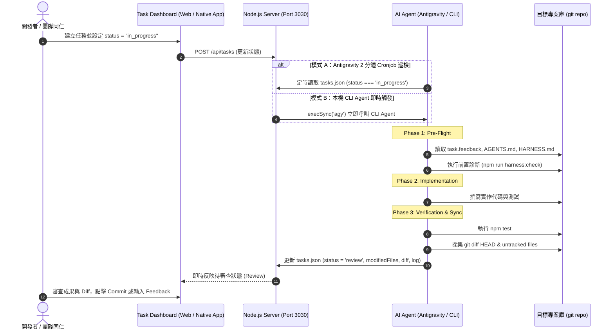

# Task Dashboard 架構特色、運作機制與團隊分享指南

> **專案**: Task Dashboard (`task-dashboard`)  
> **目標**: 為團隊同仁提供淺顯易懂的分享文件，說明 Task 開票模式、系統特色、運作流程與 CLI/輪巡雙軌機制分析。  
> **版本**: v1.0.0 (2026-09-02)  

---

## 💡 1. Task 開票模式 vs 即時 Chat 對話模式

傳統 AI 輔助開發多採用「即時 Chat 對話形式」，而 Task Dashboard 引入了「Task 開票導向模式」。兩者比較如下：

| 維度 | 💬 即時 Chat 對話模式 | 📋 Task 開票導向模式 (Task Dashboard) |
|---|---|---|
| **溝通形式** | 隨機問答、一對一即時對話 | 結構化 Ticket（包含標題、描述、優先級、標籤、依賴關係） |
| **脈絡保存 (Context)** | 依賴單一對話視窗，歷史訊息過長時易產生 Context Overflow 與記憶遺失 | 任務與狀態獨立持久化（專案路徑、相關文檔、Harness 規格一目瞭然） |
| **執行與驗收** | AI 修改完畢後需人工手動檢查或詢問結果 | 內建 3-Phase Gate，強制驗證測試通過並自動採集全量 `git diff` |
| **工作流相容性** | 偏向一對一協助打字 | 完全相容 Kanban / Scrum 敏捷看板流程與非同步協作 |
| **審查修正 (Feedback)** | 需在對話中重新下提示詞 (Prompt) 描述改單 | 支援 `task.feedback` 機制，改單回饋自動作為下次開工的最高優先級目標 |

---

## 🌟 2. Task Dashboard 的四大核心特色

1. **本機原生與輕量封裝**：
   - 結合 Objective-C Cocoa + WebKit 原生外殼 (`dist/TaskDashboard.app`) 與 Node.js 本地 REST API。
   - 毫秒級編譯打包，支援 macOS 即時熱更新與原生命週期管理。

2. **嚴格 3-Phase Execution Gate (三階段執行門禁)**：
   - **Phase 1: Pre-Flight**：優先檢查 `task.feedback` 審查指示、讀取專案 `AGENTS.md` / `HARNESS.md` 並執行前置診斷。
   - **Phase 2: Implementation**：嚴格遵守專案合規原則進行程式碼實作。
   - **Phase 3: Verification & Review Promotion**：自動執行測試 (`npm test`)、採集完整未截斷 `git diff` 與 `modifiedFiles`，寫回 `executionLog` 後推進至 `review` 階段。

3. **Single Source of Truth (SSOT) 資料庫解耦**：
   - 執行期真實資料庫固定儲存於 `~/Library/Application Support/TaskDashboard/tasks.json`。
   - 倉庫內的 `data/` 目錄僅作為全新檢出時的範本，執行期絕不污染版本控制庫。

4. **雙軌自動驅動架構 (Dual Automation Engines)**：
   - 同時支援 **Antigravity 背景 Cronjob 巡檢** 與 **本機 CLI Agent 即時觸發**。

---

## 🔄 3. 使用場景 (Use Cases) 與運作機制 (Flows)

### 3.1 典型使用場景 (Use Case Scenario)

```
[情境描述]：
工程師 Alice 需要替後端 REST API 增加新端點並修正驗證邏輯：
1. Alice 在 Task Dashboard 上建立任務 TASK-020：「修正 API 驗證並新增 /api/health 端點」。
2. 任務拖曳或設定為 `in_progress` 狀態。
3. AI 代理人（Antigravity 或 CLI Agent）自動被喚醒，讀取專案規範與測試。
4. AI 完成程式碼實作並跑過 `npm test`。
5. AI 將全量 Git Diff 與執行日誌寫回 `tasks.json` 並推進至 `review`。
6. Alice 在 Dashboard 點擊檢閱 Diff；若有問題可輸入 Feedback 退回，AI 將針對 Feedback 自動二次修正。
```

### 3.2 系統運作流程圖 (System Sequence Diagram)



---

## ⚡ 4. CLI 模式 vs 定時輪巡機制 (Cronjob) 比較與未來優化

### 4.1 機制對比表 (Comparison Table)

| 比較項目 | ⚡ 本機 CLI Agent 即時觸發模式 | 🔄 2 分鐘 定時輪巡 (Cronjob) 模式 |
|---|---|---|
| **觸發時機** | 任務狀態變更為 `in_progress` 的**瞬間** | 每 2 分鐘一次固定脈衝喚醒 |
| **響應速度** | 秒級即時啟動 (< 1 秒) | 0 ~ 120 秒延遲 (平均 60 秒) |
| **資源與 Token 開銷** | 事件驅動，無任務時 0 開銷 | 每 2 分鐘需調用一次判斷腳本 |
| **系統相依性** | 依賴本機 CLI 工具鏈 (如 `agy` / `claude-cli`) | 依賴 Agent 內建 `schedule` 排程器 |
| **優點 (Pros)** | 極速反應、體驗流暢、不浪費資源 | 被動可靠、不畏懼 Server 重啟、適合長任務與背景維護 |
| **缺點 (Cons)** | 若本機 CLI 環境未裝易呼叫失敗 | 存在巡檢時間差，高頻測試時稍有等待感 |
| **最佳適用場景** | 本機高頻互動式開發、即時任務處理 | 批次維護、背景巡檢、被動狀態對齊 |

### 4.2 未來架構優化對策 (Future Enhancement Roadmap)

若具備更佳的系統條件，可透過以下三方向進行終極優化：

1. **檔案系統事件驅動 (File System Watcher / Event-Driven)**：
   - 採用 `chokidar` 或 macOS `fsevents` 監聽 `tasks.json` 的檔案異動事件，取代 2 分鐘 Polling，達到 **0 資源浪費且秒級被動觸發**。
2. **WebSocket / Server-Sent Events (SSE) 雙向推播**：
   - 後端 Server 與 Dashboard / Native App 建立 WebSocket 連線，狀態變更與日誌串流 (Log Streaming) 實時推播至前端。
3. **Task Execution Worker Queue (任務隊列池)**：
   - 當有多個 `in_progress` 任務時，引入 SQLite / Redis 隊列機制，支援任務優先級佇列 (Priority Queue) 與並行/串行排程控制。

---

## 🎯 5. 結論

Task Dashboard 透過將 AI 開發行為「票務化 (Ticketed)」、「標準化 (3-Phase Gate)」與「雙軌自動化 (CLI + Cron)」，為團隊提供了一個兼具**高透明度、強品質把關與低溝通開銷**的 AI 協作生態系。
